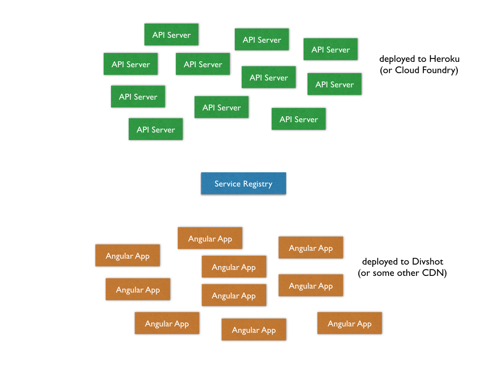
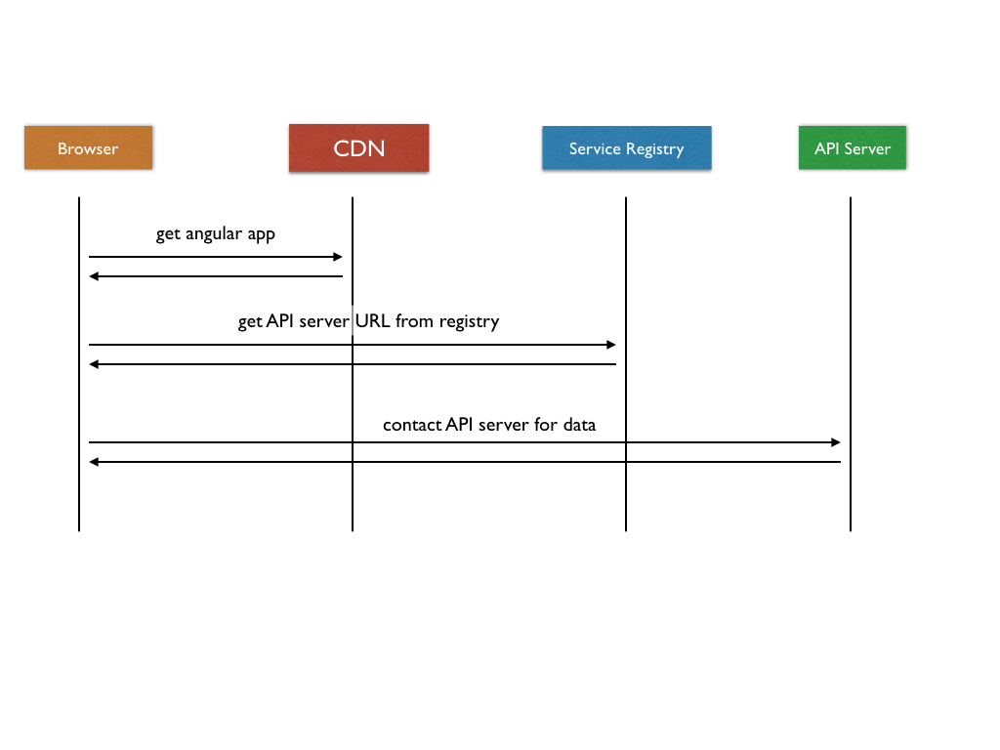
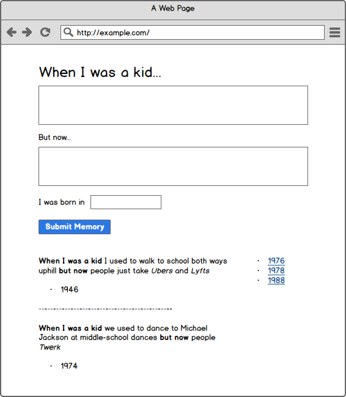
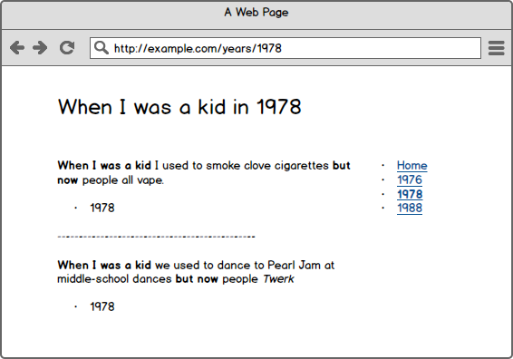

# Microservice Memories

## Architecture

This is a collaborative application that will involve you and your classmates and the instructors.  It involves 3 components:

- A series of Angular apps all deployed to some static host that supports URL rewriting (like Divshot)
- A series of Express API apps all deployed to some host such as Heroku or Cloud Foundry
- A Service Registry app

You'll write an Angular app and also and Express app.  

- Your Angular app will contact the Service Registry
- The Service Registry will hand your Angular app a list of URLs
- Your Angular app will choose one, and use _it_ as the backend service for that session

NOTE: Every time you refresh a page, you'll get a new server.  In this exercise, that means that users will see different data every time they refresh the page.  This is not a normal flow - in real life, all those app servers would talk to the same database (or cluster of databases), and users would have a consistent experience.

## Angular App

The Angular app consists of two routes:

### The Home Page

- Users can add a memory
- Users can see all memories
- Users can see a list of unique years

### The Year Page

- Users can see all memories from a certain year
- Users can see a link back to the home page

### Setting up the Angular App

- Build an Angular app
- Setup the routes to use HTML5 mode
- Setup the controllers to contact the service registry first, then used the returned URLs to find / post the data
- Consider using https://bootswatch.com/ if you haven't used it before
- Run locally with superstatic
- Deploy to divshot

## Express App

[Building the Express API](./EXPRESS_API.md)
